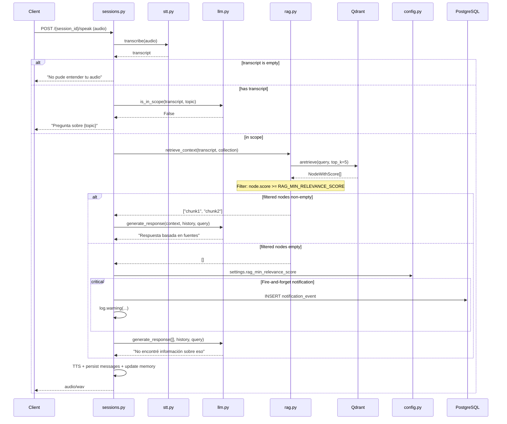

# Design: RAG Relevance Threshold

## Technical Approach

Add a minimum relevance score filter to the RAG retrieval pipeline, gated by a required `RAG_MIN_RELEVANCE_SCORE` env var. When the filter eliminates all chunks, the LLM returns a pre-defined graceful message without calling Ollama, and the system logs + persists a notification event for the professor. Follows existing Pydantic Settings, async service patterns, and the router/service separation already in place.

## Architecture Decisions

### Decision: Score filter location

| Option                                     | Tradeoff                                                  | Decision                                                                                       |
| ------------------------------------------ | --------------------------------------------------------- | ---------------------------------------------------------------------------------------------- |
| Filter in Qdrant query (`score_threshold`) | Moves filtering to the DB, reduces network transfer       | **Rejected** — couples pipeline logic to Qdrant's exact scoring semantics; harder to unit test |
| Filter post-retrieval in `rag.py`          | Keeps filtering in the service layer, testable with mocks | **Accepted** — follows existing pattern of post-processing in `retrieve_context`               |

### Decision: Empty-context response strategy

| Option                                                     | Tradeoff                                                            | Decision                                                                                |
| ---------------------------------------------------------- | ------------------------------------------------------------------- | --------------------------------------------------------------------------------------- |
| LLM system prompt instructing "say you don't know"         | No code change needed, but unreliable — LLMs hallucinate regardless | **Rejected** — existing system prompt already says this, yet hallucinations still occur |
| Early return in `llm.generate_response` before Ollama call | Deterministic, no LLM cost, testable                                | **Accepted** — skips LLM entirely when context is empty                                 |

### Decision: Notification persistence model

| Option                                    | Tradeoff                                            | Decision                                          |
| ----------------------------------------- | --------------------------------------------------- | ------------------------------------------------- |
| New `LowQualityEvent` table               | Clean schema, decoupled from existing models        | **Accepted** — minimal schema, single migration   |
| Reuse `Message` table with synthetic role | Confuses message semantics, breaks existing queries | **Rejected** — would pollute conversation history |

### Decision: Async notification dispatch

| Option                          | Tradeoff                                         | Decision                                               |
| ------------------------------- | ------------------------------------------------ | ------------------------------------------------------ |
| `asyncio.create_task` in router | Zero latency, no infra needed                    | **Accepted** — lightweight, fire-and-forget per spec   |
| Redis queue / background worker | Durable delivery, but overengineered for CRIT-01 | **Rejected** — can be added in later release if needed |

## Data Flow



## File Changes

| File                     | Action | Description                                                                                  |
| ------------------------ | ------ | -------------------------------------------------------------------------------------------- |
| `core/config.py`         | Modify | Add `rag_min_relevance_score: float` — required, no default                                  |
| `services/rag.py`        | Modify | Filter `nodes` by `node.score >= settings.rag_min_relevance_score` before extracting content |
| `services/llm.py`        | Modify | Early return of graceful message when `context_chunks` is empty                              |
| `routers/sessions.py`    | Modify | After scope check passes + RAG returns empty → fire-and-forget notification (log + DB event) |
| `models/db.py`           | Modify | Add `ThresholdNotification` table (professor_id, query, created_at)                          |
| `tests/conftest.py`      | Modify | Add `RAG_MIN_RELEVANCE_SCORE=0.0` env var default                                            |
| `tests/test_rag.py`      | Create | Unit tests for score filter                                                                  |
| `tests/test_llm.py`      | Create | Unit tests for empty-context early return                                                    |
| `tests/test_sessions.py` | Create | Integration test for threshold → notification flow                                           |

## Interfaces / Contracts

### Config (core/config.py)

```python
# Required — missing or invalid raises ValidationError at startup
rag_min_relevance_score: float
```

### RAG (services/rag.py)

```python
async def retrieve_context(query: str, professor_collection: str, top_k: int = TOP_K) -> list[str]:
    """Return chunks with score >= settings.rag_min_relevance_score, or [] if none qualify."""
```

### LLM (services/llm.py)

```python
async def generate_response(system_prompt, history, context_chunks, query) -> str:
    """If context_chunks is empty, return graceful message immediately. Otherwise call Ollama."""
```

### DB Model (models/db.py)

```python
class ThresholdNotification(Base):
    __tablename__ = "threshold_notifications"

    id: Mapped[uuid.UUID] = mapped_column(primary_key=True, default=uuid.uuid4)
    professor_id: Mapped[uuid.UUID] = mapped_column(ForeignKey("professors.id"))
    query: Mapped[str] = mapped_column(Text)
    created_at: Mapped[datetime] = mapped_column(default=datetime.utcnow)
```

## Testing Strategy

| Layer       | What to Test                                         | Approach                                                  |
| ----------- | ---------------------------------------------------- | --------------------------------------------------------- |
| Unit        | Config: missing/invalid env var fails at startup     | Pydantic `Settings` validation with `model_validate`      |
| Unit        | RAG: score filter correctly includes/excludes chunks | Mock `AsyncQdrantClient`, inject nodes with known scores  |
| Unit        | RAG: empty collection returns `[]`                   | Existing test + confirm filter still works on empty       |
| Unit        | LLM: empty context returns graceful message          | Direct call — no async dispatch needed                    |
| Unit        | LLM: non-empty context calls Ollama normally         | Mock `httpx.AsyncClient`                                  |
| Integration | Threshold filter in `sessions.py` speak endpoint     | Mock STT + LLM scope, inject controlled RAG response      |
| Integration | Fire-and-forget notification (log + DB event)        | Assert `ThresholdNotification` row created + log captured |

## Migration / Rollout

No migration required. The `ThresholdNotification` table will be auto-created by SQLAlchemy on first run (via `Base.metadata.create_all` in `main.py`'s existing startup sequence). The env var is required — `.env` files must be updated before deploy. Rollback: set `RAG_MIN_RELEVANCE_SCORE=0.0` to pass all chunks, or revert the four modified files.

## Open Questions

- [ ] What is the recommended initial threshold value for the `.env` template? Proposal suggests 0.75 — needs real-data tuning.
      85%
- [ ] Should `top_k` be increased when threshold filter is active (e.g., retrieve 10, keep top 5 that pass)? Spec says no for now, but worth discussing if false negatives are too frequent.
      Increase top_k to "play itsafe"
